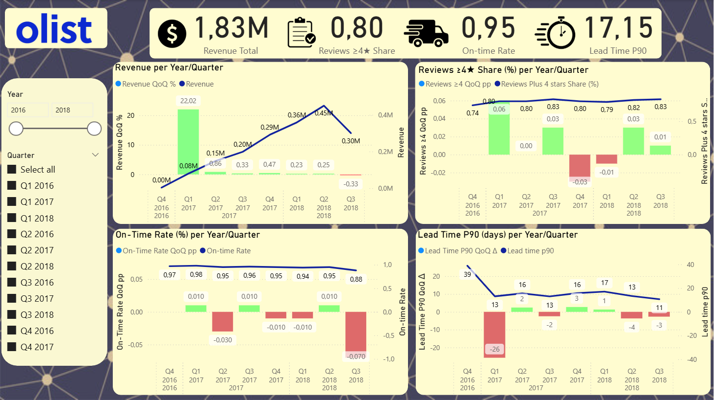
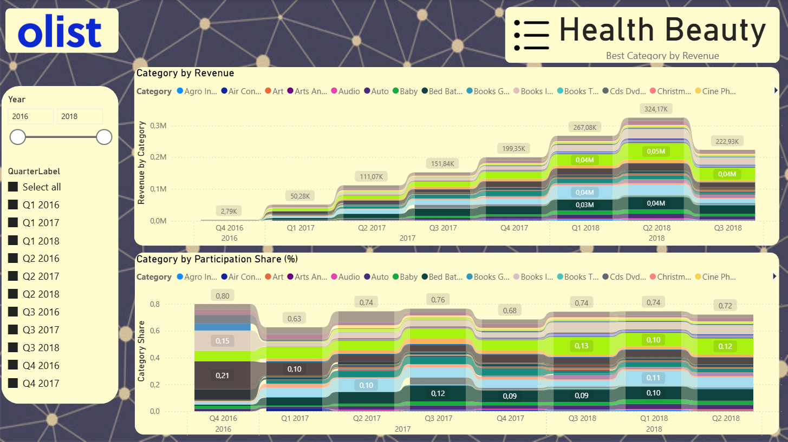
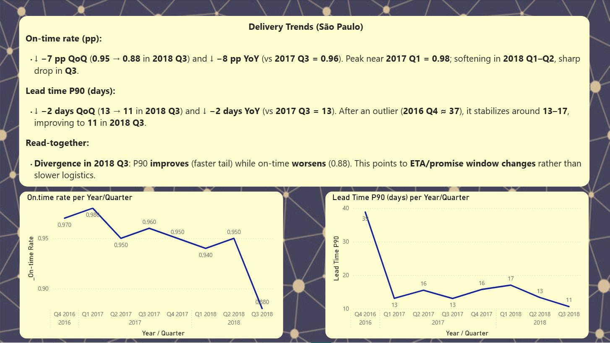
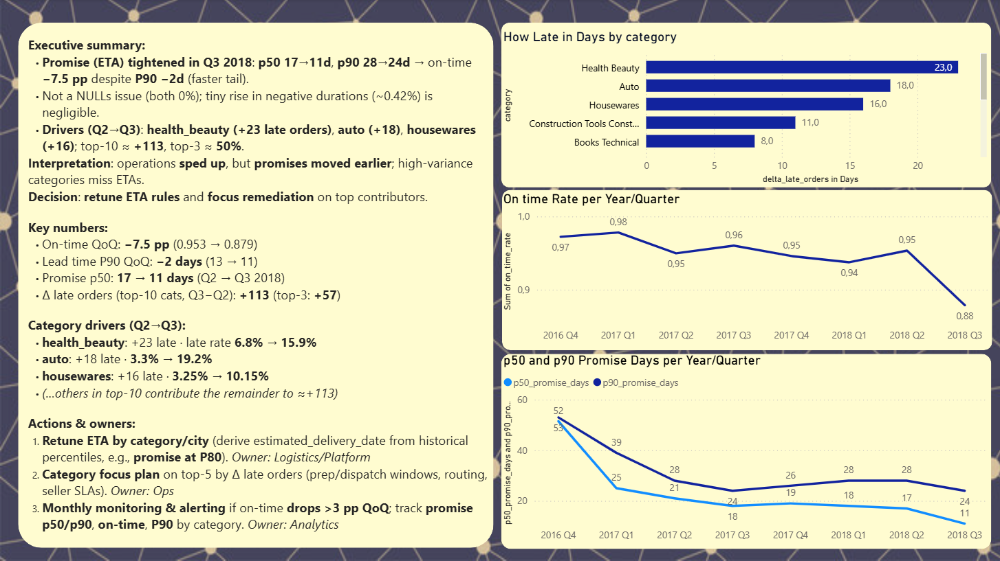

<!-- 
Una frase explicando para que sirve cada paquete (En inglés):

    pandas, numpy, matplotlib, scipy, SQLAlchemy, psycopg2-binary, python-dotenv, requests

Incluye estas secciones (bullets, sin detalles técnicos):

    * Resumen: “Proyecto e-commerce (Olist) con Python+SQL. KPIs YoY y A/B.”

    * Stack: Python, PostgreSQL, (Docker si elegiste A), notebooks.

    * Qué aprenderás: ingestión, limpieza, KPIs, visualización, pruebas estadísticas.

    * Progreso: “Fase 0 completada. En curso: Fase 1 (repo + entorno).”

    * KPIs (en texto): lista los 5 que definiste (sin fórmulas). -->

# E-commerce Analytics (Python + SQL + Power BI) — Olist Dataset (Brazil)

End-to-end analytics project using Python, PostgreSQL, and Power BI on the Olist Brazilian E-commerce dataset.

- **Focus**: São Paulo city, orders with delivered status only, Year quarters come from delivered_date.
- **Goal**: To build a small analytic warehouse, compute KPIs, and publish an executive dashboard to analyze and explain business insights.

## Tech stack

* Python 3.11 (pandas, SQLAlchemy, python-dotenv)

* PostgreSQL (Docker)

* SQL (DDL, staging → dims/facts → analytic views)

* Power BI (4 pages: KPIs, Trends, Delivery, Summary)

## Repository structure
```
.
├─ sql/
│  ├─ 00_schemas.sql               # schemas (staging, core, analytics)
│  ├─ 10_staging.sql               # staging tables (orders_raw, order_items_raw, reviews_raw, ...)
│  ├─ 20_core_model.sql            # core.dim_* and core.fact_events (DDL)
│  ├─ 30_constraints_indexes.sql   # PK/FK, indexes
│  ├─ 50_views.sql                 # KPI views (revenue, reviews, lead time P90, on-time, category share)
│  ├─ 51_kpi_consolidated.sql      # analytics.vw_kpi_quarter_sp (quarter-level)
│
├─ scripts/
│  ├─ load_orders.py               # minimal CSV loader (sample_orders.csv → staging.orders_raw)
│  └─ [other loaders].py           # optional loaders (order_items, reviews, sellers…)
│
├─ data/                           # This folder contains the source of raw data used for this project. 
│                                  # Won't be uploaded to the online repository
│
├─ notebooks/
│  └─ EDA.ipynb                    # quick EDA / sanity checks (optional)
│
├─ docker-compose.yml              # Postgres service
├─ .env                            # DB credentials (never commit secrets)
└─ Dashboard.pbix       # Power BI report (pages 1–4)
```

## Quick start (local)

### 0) Prereqs

- Docker Desktop

- Python 3.11 with virtualenv

- Power BI Desktop

### 1) Environment

Create .env in the repo root (This is an example):

```
DB_USER=postgres
DB_PASS=postgres
DB_NAME=local-postgres-ecom
DB_HOST=localhost
DB_PORT=5432
```

### 2) Database (Docker)
```
docker compose up -d
```
Optional: confirm the DB is up (port 5432).

### 3) Create schemas & tables (run in order)
Use your VS Code SQL extension (connected to local-postgres-ecom) or psql:
```
\i sql/00_schemas.sql;
\i sql/10_staging.sql;
\i sql/20_core_model.sql;
\i sql/30_constraints_indexes.sql;
```

### 4) Python env & loaders

```
python -m venv .venv
. .venv/Scripts/activate         # (PowerShell)   OR   source .venv/bin/activate (bash)
pip install -r requirements.txt  # if present; otherwise install: pandas sqlalchemy psycopg2-binary python-dotenv
python scripts/load_orders.py    # loads data → staging.orders_raw (sample file)
```
Repeat with your other loaders when you’re ready (items, reviews, sellers…).
Then populate dims/fact with your transformation SQL (or a loader script if you wrote one).

### 5) Analytic views
```
\i sql/50_views.sql;
\i sql/51_kpi_consolidated.sql;
\i sql/52_drivers_views.sql;
```
### 6) Open the dashboard
Open E-commerce-Analytics.pbix and refresh.

Slicers: City = São Paulo, Orders = delivered, Quarter by delivered_date.
<!-- TODO: Review the title of the next section -->
## Analytics Dashboard

### KPIs (São Paulo city, delivered status only, quarterly)

- Revenue (GMV w/o freight): sum(price)

- Share of reviews ≥ 4★: avg(1 if review_score≥4)

- Lead Time P90 (days): P90(delivered_date − approved_date)

- On-time rate: avg(1 if delivered_date ≤ estimated_date)

- Top category share: category revenue / total revenue (quarter)

- Key consolidated view: analytics.vw_kpi_quarter_sp.

### Delivery analysis (evidence & drivers)

Promise (ETA) vs On-time — **analytics.vw_promise_vs_ontime_quarter_sp**

- Q3 2018: p50 ETA 17→11 days, p90 28→24 → On-time −7.5 pp, while P90 improved −2 days.

Drivers (category contribution) — **analytics.vw_delta_late_orders_cat_sp**

- Δ late orders (Q3 − Q2 2018) concentrated in: health_beauty (+23), auto (+18), housewares (+16).

- Top-10 ≈ +113; top-3 ≈ 50% of total deterioration.

### Power BI — pages overview
<!-- TODO: ADD SCREENSHOTS -->
1. KPIs (Overview)
Cards: revenue, reviews ≥4★ share, lead time P90, on-time rate; slicers for time/filters.



2. Trends
Line charts over quarters (revenue & reviews share). Quick annotations for peaks/dips.



3. Delivery Trends
Line charts for On-time (pp) and Lead Time P90 (days).
Note the Q3 2018 divergence (on-time down while P90 improves).



4. Summary (Executive)

    - Executive bullets (ETA tightened → on-time down; not NULLs).

    - Key numbers (QoQ deltas).

    - Drivers bar (Δ late orders by category).

    - Actions (retune ETA by category/city; focus plan on top contributors; monthly alerting).


`


## What I learned (highlights)

- Modeling order-item grain fact with clean dim_calendar / dim_customer / dim_product keys.

- Using percentiles (P90) to describe tail performance and YoY/QoQ comparisons.

- Diagnosing on-time vs ETA: when promises tighten, on-time can fall even while absolute times improve.

- Ranking contributors via Δ late orders (not only pp deltas) to focus remediation.

- Building re-usable SQL views that feed BI directly.

## Data source

- Olist Brazilian E-commerce dataset (Kaggle).

## License

This project is for learning and portfolio purposes. Use at your own risk.

## About the Author

<table border="0">
  <tr>
    <td>
      
    </td>
    <td align="left">
      <b>Felipe Viera Klein</b><br>
      Agricultural Engineer & Data Scientist<br>
      <a href="https://www.linkedin.com/in/felipevk/">🔗 LinkedIn</a> |
      <a href="https://github.com/Vierinsky">🐙 GitHub</a>
    </td>
  </tr>
</table>